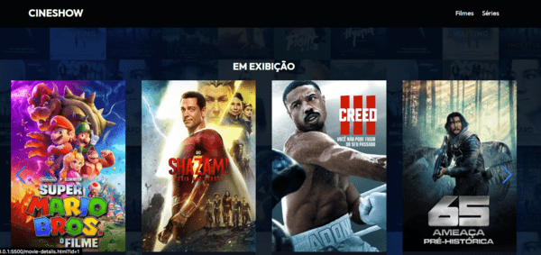
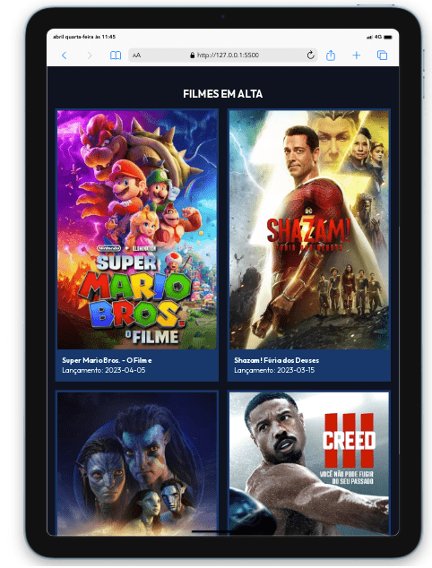
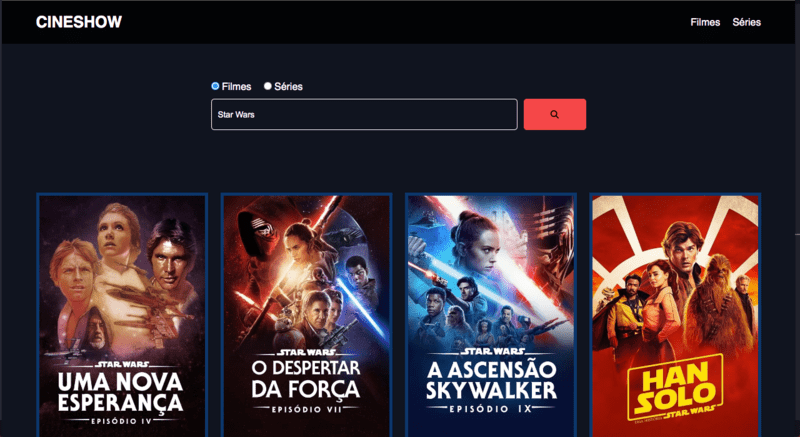

## CineShow app - Visão Geral

CineShow App - uma aplicação de entretenimento que permite aos usuários navegarem por diferentes filmes e séries usando a API The MovieDB. As páginas são construídas dinamicamente com base nas informações fornecidas pela API. Aprendi bastante durante o processo de desenvolvimento, desde como a API funciona até a implementação de funcionalidades e correção de bugs.

O aplicativo possui roteamento básico e controle de estado de alguns elementos. Ele inclui recursos como busca, exibição de filmes/séries em destaque, detalhes do filme/série e layout responsivo. As tecnologias usadas incluem The MovieDB API, a biblioteca JavaScript Swiper, HTML5, CSS3 e JavaScript.

Embora ainda haja espaço para melhorias, estou satisfeito com o resultado inicial.

[Ver ao Vivo](https://cineshow.netlify.app/)

### Recursos e Funcionalidades

- Roteamento: Cada página tem seus próprios arquivos HTML, CSS e JavaScript. As páginas são vinculadas entre si usando roteamento, para que os usuários possam navegar entre elas clicando nos links de navegação.
- Consumo de API e Manipulação do DOM: 
- Busca de filmes e séries: o usuário pode buscar filmes e séries utilizando a barra de pesquisa na página inicial do aplicativo.
- Lista de filmes e séries em destaque: o aplicativo exibe uma lista de filmes/séries em destaque na página correspondente.
- Detalhes do filme ou série: ao clicar em um filme/série, o usuário pode ver informações detalhadas sobre o filme, incluindo sinopse, elenco, trailer e outras informações relevantes.
- Leiaute responsivo: é possível utilizar a aplicação em diferentes tipos de tela. 

### Screeshot

### Ferramentas utilizadas

[The MovieDB](https://developers.themoviedb.org/) - API com dados de séries e filmes
[Swiper](https://swiperjs.com/) - Lib JS para construção de sliders. 
Javascript
HTML Semântico
CSS3 

### O que aprendi
- Como consumir APIs de terceiros para buscar informações dinâmicas.
- Como manipular o DOM com JavaScript para criar e atualizar elementos HTML.
- Como usar bibliotecas de terceiros, para facilitar o desenvolvimento e melhorar a aparência do aplicativo.
- Como implementar recursos avançados, como a busca de filmes e séries, para tornar o aplicativo mais útil e funcional.

Como resultado, pude aprimorar minhas habilidades de programação e me tornar mais confortável ao trabalhar com JavaScript para criar aplicativos web.

### O que pode ser melhorado
- Organizar o código JavaScript em módulos para tornar o desenvolvimento mais eficiente e fácil de gerenciar.
- Estudar e implementar funcionalidades que facilitem a vida do usuário

### Onde me encontrar

- [Linkedin](https://www.linkedin.in/aecio-neto)
- [Site Pessoal - Aécio Neto](https://aecioneto.com.br)