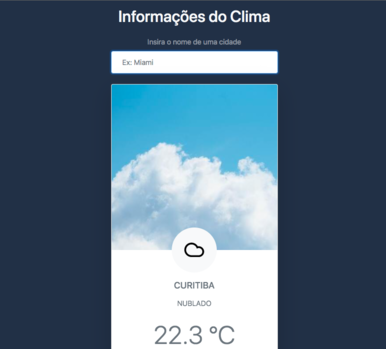

# Aécio Neto - Weather App

Tool to find out what the weather is like in a certain place.

## Table of contents

- [Overview](#overview)
  - [The challenge](#the-challenge)
  - [Screenshot](#screenshot)
  - [Links](#links)
  - [Built with](#built-with)
  - [What I learned](#what-i-learned)
  - [Continued development](#continued-development)
- [Author](#author)


## Overview

Weather App created with vanilla javascript, using fetch API and DOM manipulation. Users can search for cities and get information about the weather.

### The challenge

Users should be able to:

- Search for the weather in a given city.
- Knowing the weather through visual elements
- Keep information saved in the browser for future reference. (LocalStorage)

### Screenshot




### Links

- Solution URL: [Solution URL here](https://github.com/aecio-neto/portfolio/tree/main/4%20-%20advanced/1%20-%20weather-app)
- Live Site URL: [Live site URL here](https://aecioneto.com.br/projetos/weather-app)

### Built with

- Semantic HTML5 markup
- CSS3

- [Bootstrap](https://getbootstrap.com/) - For Styles
- [AccuWeather API](https://developer.accuweather.com/apis) - Weather API


### What I learned

I developed an overview of asynchronous javascript. How to deal with requests, responses, errors and use JSON to provide useful information to the user.

```js
const diplayCityWeatherInfo = async cityName => {
  const [{ Key, LocalizedName }] = await getCityData(cityName)
  const [{ WeatherText, Temperature, IsDayTime, WeatherIcon }] = await getCityWeather(Key)
  const timeIcon = ``
  timeImg.src = IsDayTime ? './src/day.jpeg' : './src/noite.jpeg'
 
  timeIconContainer.innerHTML = timeIcon
  cityNameContainer.textContent = LocalizedName
  cityWeather.textContent = WeatherText
  cityTemperature.textContent = Temperature.Metric.Value
  insertCityCard()
}
```

### Continued development

I will continue to study asynchronous javascript. That first application gave me an overview of how things work. Now, it's time to keep practicing, experimenting, innovating.

Who knows, maybe create the same app using other technologies (styled components, react) and implement new features.

## Author

- Website - [Aécio Neto](https://www.aecioneto.com.br)
- Linkedin - [aecio-neto](https://www.linkedin.com/in/aecio-neto)

